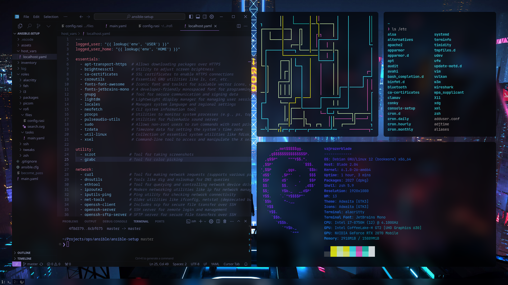
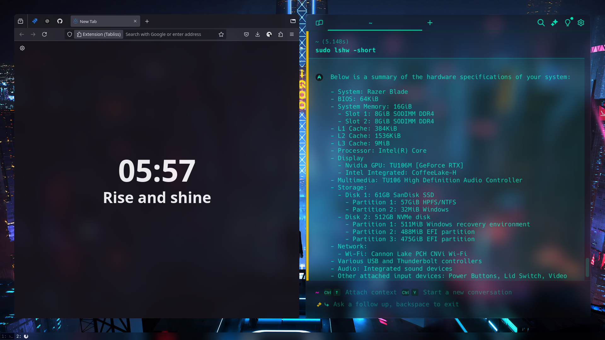
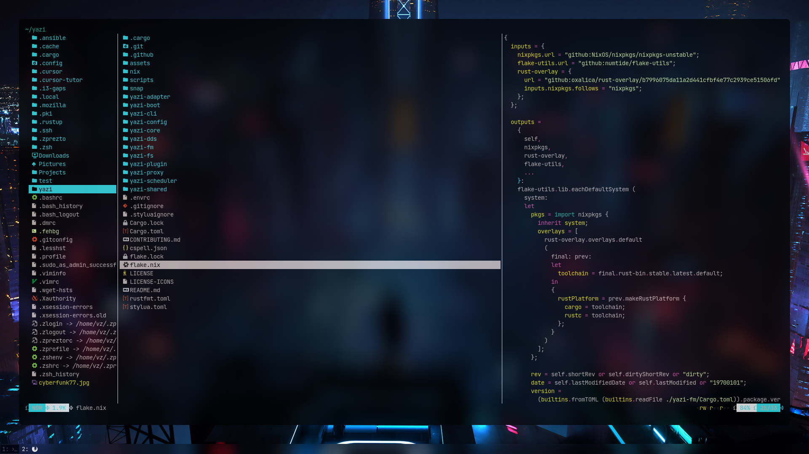

# Ansible Setup Project

  

## 🌟 Overview


Welcome to the Ansible Setup Project! This project is designed to automate the setup of various applications and configurations on Debian-based systems using Ansible.

## 📂 Project Structure

```plaintext
.
├── assets
│   ├── cursor_terminals.png
│   ├── Cyberfunk77.gif
│   ├── firefox_warp.png
│   ├── openrgb.png
│   └── yazi.png
├── ansible.cfg
├── host_vars
│   └── localhost.yaml
├── inventory
│   └── hosts.yaml
├── main.yaml
├── README.md
└── roles
    ├── alacritty
    │   ├── files
    │   │   └── alacritty.yml
    │   └── tasks
    │       └── main.yaml
    ├── feh
    │   ├── files
    │   │   └── wallpaper.jpg
    │   └── tasks
    │       └── main.yaml
    ├── i3
    │   ├── files
    │   │   └── config
    │   └── tasks
    │       └── main.yaml
    ├── packages
    │   └── tasks
    │       └── main.yaml
    ├── picom
    │   ├── files
    │   │   └── picom.conf
    │   └── tasks
    │       └── main.yaml
    ├── rofi
    │   ├── files
    │   │   ├── config.rasi
    │   │   └── search.svg
    │   └── tasks
    │       └── main.yaml
    ├── ssh
    │   ├── handlers
    │   │   └── main.yaml
    │   └── tasks
    │       └── main.yaml
    ├── tweaks
    │   └── tasks
    │       └── main.yaml
    └── zsh
        └── tasks
            ├── main.yaml
            ├── prezto.yaml
            ├── zsh-autosuggestions.yaml
            └── zsh.yaml
```

## 📸 Screenshots

### Cursor Editor & Terminals


### Firefox & Warp AI Terminal


### Yazi


## 🛠️ Roles and Playbooks

### Alacritty
- Configuration files are located in `roles/alacritty/files/alacritty.yml`.
- Tasks are defined in `roles/alacritty/tasks/main.yaml`.

### Feh
- Files in `roles/feh/files` contain wallpapers including `wallpaper.jpg`.
- Tasks are defined in `roles/feh/tasks/main.yaml`.

### i3
- Window manager configurations are in `roles/i3/files/config`.
- Tasks are executed as per `roles/i3/tasks/main.yaml`.
- Installs my custom Cyberfunk77 theme made from scratch by yours truly.

### Packages
- Essential packages are managed through `roles/packages/tasks/main.yaml`.

### Picom
- Configuration in `roles/picom/files/picom.conf`.
- Tasks structure defined in `roles/picom/tasks/main.yaml`.

### Rofi
- UI configurations in `roles/rofi/files`.
- The task definitions are in `roles/rofi/tasks/main.yaml`.

### SSH
- Task and handler configurations located in `roles/ssh`.

### Zsh
- Configurations for Zsh and Prezto managed via `roles/zsh/tasks`.

## ⚙️ Configuration

- `ansible.cfg` contains the Ansible configuration settings.
- `host_vars/localhost.yaml` provides host-specific variables.
- Inventory hosts are defined in `inventory/hosts.yaml`.

## ℹ️ Logs

Logs for playbook runs can be found in `log/ansible.log`.

## ✨ How to use

1. Ensure Ansible is installed: [Ansible Installation Guide](https://docs.ansible.com/ansible/latest/installation_guide/intro_installation.html)
2. Clone this repository to your local machine.
3. Set up your host information in the `inventory/hosts.yaml` file.
4. Run the playbooks using:

   ```sh
   ansible-playbook main.yaml
   ```

## 📜 License

This project is licensed under the MIT License - see the [LICENSE.md](LICENSE.md) file for details.

Enjoy automating your setup with Ansible! 🚀
